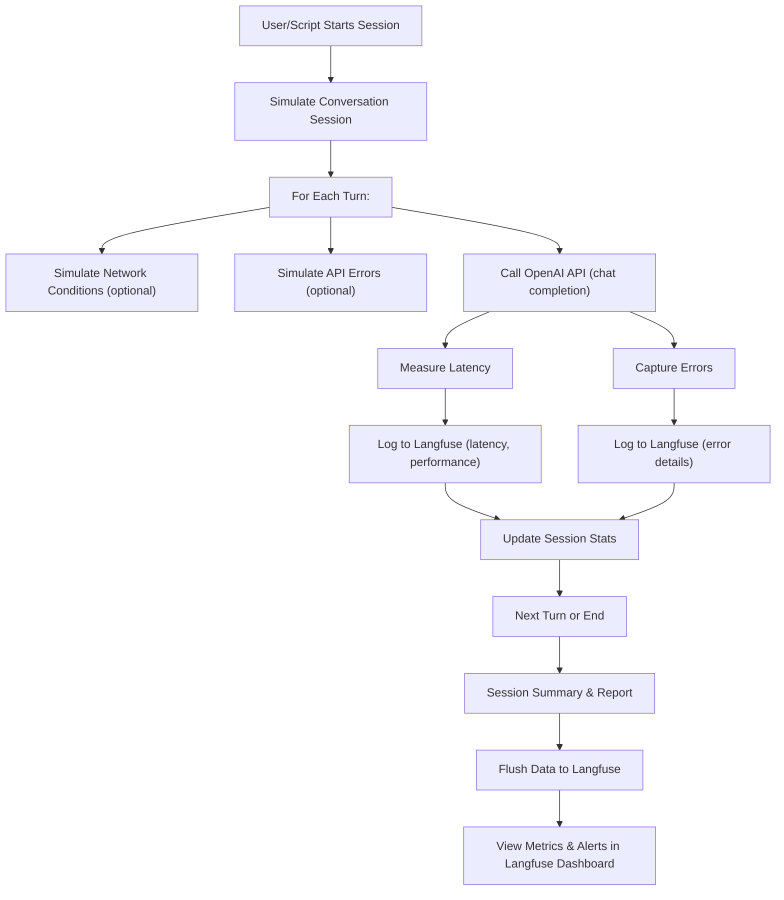

# Langfuse Latency Monitor

Langfuse Latency Monitor is a Python tool for simulating, monitoring, and analyzing the latency and error rates of OpenAI chat completions, with detailed tracking and visualization in the Langfuse dashboard. It supports error and slow-call simulation, session-level statistics, and is ideal for stress-testing LLM-based chat systems.

## Features
- **Latency & Error Monitoring:** Tracks each chat turn's latency and errors, logs to Langfuse.
- **Simulation:** Randomly simulates slow network calls and API errors for robust testing.
- **Session Statistics:** Aggregates and reports per-session and overall performance.
- **Langfuse Integration:** All metrics and errors are sent to Langfuse for visualization and alerting.

## Setup
1. **Clone the repository:**
   ```bash
   git clone https://github.com/nishanttomar21/langfuse-latency-monitor.git
   cd langfuse-latency-monitor
   ```
2. **Install dependencies:**
   ```bash
   pip install -r requirements.txt
   ```
3. **Configure environment:**
   - Create a `.env` file with your OpenAI and Langfuse credentials:
     ```env
     OPENAI_API_KEY=your-openai-key
     LANGFUSE_PUBLIC_KEY=your-langfuse-public-key
     LANGFUSE_SECRET_KEY=your-langfuse-secret-key
     LANGFUSE_HOST=https://cloud.langfuse.com
     ```

## Usage
Run the main script to simulate multiple monitored chat sessions:
```bash
python main.py
```
- The script will print session and turn-level stats, simulate errors/latency, and send all data to Langfuse.
- Check your Langfuse dashboard for detailed metrics, slow call alerts, and error tracking.

## Flow Overview



## Screenshots
Below are some screenshots of the tool and Langfuse dashboard:

| Screenshot | Description |
|------------|-------------|
|  | Example session output in terminal |
|  | Langfuse dashboard: latency metrics |
|  | Langfuse dashboard: error tracking |
|  | Langfuse dashboard: session details |
|  | Langfuse dashboard: performance alerts |

## License

This project is licensed under the MIT License. See the [LICENSE](LICENSE) file for details.
